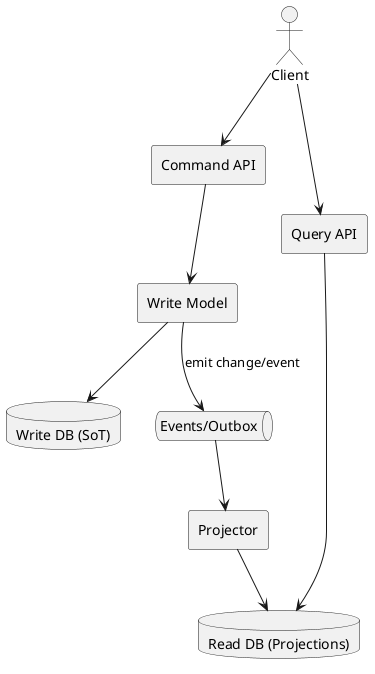

# CQRS (como arquitectura: Write model + Read model + proyecciones)

## En una línea
> Arquitectura que separa **escrituras** (modelo de comandos con invariantes) y **lecturas** (modelo optimizado para queries), normalmente alimentando el read model con eventos o cambios.

## Objetivos / atributos de calidad
- Performance: ✅ lecturas muy rápidas; ⚠️ overhead de proyecciones
- Escalabilidad: ✅ escala reads/writes por separado
- Disponibilidad: ✅ read model puede seguir sirviendo si write está degradado (depende diseño)
- Seguridad: ✅ reglas fuertes en write model; queries no tocan invariantes
- Mantenibilidad: ⚠️ más piezas (proyecciones, sincronización)

## Componentes típicos
- API de Commands (create/update)
- Write model (dominio + validaciones + transacciones)
- Event/Change stream (eventos o outbox)
- Projector/Consumer (construye read model)
- Read model (views/materialized/denormalized DB)
- API de Queries (read endpoints)

## Flujo / interacción
- Write:
  - Client → Command API → Write model → DB (source of truth) → evento/outbox
- Read:
  - Client → Query API → Read model → respuesta rápida
- Proyección:
  - Outbox/eventos → projector → read model actualizado (eventual)

## Diagrama

![[CQRS Architecture.png]]

## Decisiones típicas
- ¿CQRS light (mismo DB + views) o CQRS full (read DB separado)?
- ¿Cómo propagar cambios? (outbox, CDC, eventos)
- ¿Consistencia eventual aceptable? ¿Qué pantallas requieren frescura inmediata?
- Estrategia de rebuild de proyecciones (replay o batch rebuild)
- Dedupe/idempotency en projector

## Trade-offs
- Pros
  - Lecturas optimizadas (dashboards, listados grandes)
  - Write model limpio y seguro
  - Escala reads/writes de forma independiente
- Contras
  - Eventual consistency (usuarios pueden ver datos viejos por segundos)
  - Duplicación de datos (read DB)
  - Más complejidad operativa (projector, lag, retries, DLQ)

## Cuándo usar / no usar
- ✅ Cuando reads son muy distintas a writes (reporting, dashboards)
- ✅ Cuando la performance de queries es un problema real
- ❌ CRUD simple sin pain (no lo metas por “cool”)
- ❌ Si tu equipo no está listo para operar proyecciones y observabilidad

## Observabilidad / operación
- Logs / métricas / tracing: projector lag, eventos procesados/seg, errores, DLQ, tiempo de proyección
- Alertas: lag alto, projector caído, backlog outbox, inconsistencias
- Runbook básico: pausar writes, rebuild projection, replay DLQ, reindex read DB

## Relacionado
- Patrones: [[Transactional Outbox]], [[Event-Driven]], [[Idempotency Key]], [[Retry Backoff]]
- ADRs: [[ADR-XX]]

## Referencias
- Martin Fowler — CQRS
- microservices.io — CQRS
