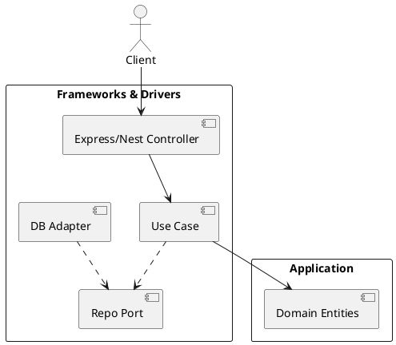

# Clean Architecture (Onion)

## En una línea
> Arquitectura centrada en el **dominio y casos de uso**, donde las dependencias apuntan hacia adentro: el dominio NO depende del framework ni de la DB.

## Objetivos / atributos de calidad
- Performance: ✅ similar a capas, con un poco más de abstracción
- Escalabilidad: ✅ excelente para crecer y cambiar infra
- Disponibilidad: ✅ depende de infra; arquitectura ayuda al cambio sin caos
- Seguridad: ✅ reglas de negocio centralizadas y testeables
- Mantenibilidad: ✅ alta (ideal para proyectos largos)

## Componentes típicos
- Entities (dominio)
- Use Cases (aplicación)
- Interface Adapters (controllers, presenters, gateways)
- Frameworks & Drivers (Express/Nest, DB, brokers)

## Flujo / interacción
- Request → Controller → Use Case → Port/Repo interface → Adapter infra → DB
- Output: Use Case produce resultado → presenter/DTO → respuesta HTTP

## Diagrama

## Decisiones típicas
- Definir Ports (interfaces) para DB/externos
- Ubicar validación: input validation en controller vs invariantes en dominio
- DTOs para entrada/salida para no filtrar modelos internos

## Trade-offs
- Pros
  - Test unitario fuerte (use cases sin DB)
  - Cambiar DB/framework es menos dolor
  - Claridad de reglas de negocio
- Contras
  - Más archivos/boilerplate
  - Puede ser “overkill” para CRUD simple
  - Requiere disciplina del equipo

## Cuándo usar / no usar
- ✅ Dominio con reglas reales (pagos, órdenes, permisos)
- ✅ Proyectos a largo plazo
- ❌ MVP ultra rápido con CRUD trivial

## Observabilidad / operación
- Logs: correlationId en request y en use cases clave
- Métricas: duración por use case, fallos por dependencia externa
- Runbook: aislar si falla en adapter (infra) o en caso de uso (dominio)

## Relacionado
- Patrones: [[Dependency Injection]], [[Adapter]], [[Facade]]
- ADRs: [[ADR-XX]]

## Referencias
- 8th Light — Clean Architecture deep dive
