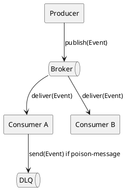

# Event-Driven Architecture (EDA)

## En una línea
> Arquitectura donde los componentes se comunican principalmente mediante **eventos** (Pub/Sub), reduciendo acoplamiento y mejorando escalabilidad.

## Objetivos / atributos de calidad
- Performance: ✅ escala bien por consumidores; ⚠️ latencia eventual
- Escalabilidad: ✅ excelente con colas/brokers
- Disponibilidad: ✅ resiliente si hay reintentos/DLQ
- Seguridad: ⚠️ más superficie (broker + consumers), requiere controles
- Mantenibilidad: ✅ si contratos de eventos están versionados y claros

## Componentes típicos
- Producers (publican eventos)
- Broker (Kafka/Rabbit/SQS/SNS/NATS)
- Consumers (procesan eventos)
- DLQ (dead-letter queue)
- Event schema/versioning

## Flujo / interacción
- Producer publica `EventEnvelope(eventId, type, payload)`
- Broker entrega a N consumers (pub/sub)
- Consumers idempotentes + retries
- Errores permanentes → DLQ

## Diagrama

![[Event-Driven Architecture.png]]

## Decisiones típicas
- Evento vs comando (evento = “ya pasó”, comando = “haz esto”)
- At-least-once vs exactly-once (normalmente at-least-once + idempotency)
- Contratos (schema) y versionado
- Ordenamiento por clave (partition key), si aplica

## Trade-offs
- Pros
  - Desacoplamiento fuerte
  - Escala consumidores fácilmente
  - Resiliencia (reintentos, buffering)
- Contras
  - Consistencia eventual
  - Debugging más difícil
  - Contratos de eventos requieren disciplina (versionado)

## Cuándo usar / no usar
- ✅ Integraciones, pipelines, procesos asíncronos, notificaciones
- ✅ Cuando quieres desacoplar dominios
- ❌ Si necesitas respuesta inmediata y consistencia fuerte en todo
- ❌ Si no tienes observabilidad/métricas (te vas a perder)

## Observabilidad / operación
- Logs: correlationId + eventId
- Métricas: consumer lag, retries, DLQ rate, processing time
- Runbook: replay de DLQ, pausar consumers, revisar poison messages

## Relacionado
- Patrones: [[Idempotency Key]], [[Retry Backoff]], [[Circuit Breaker]]
- ADRs: [[ADR-XX]]

## Referencias
- microservices.io — Event-driven architecture
