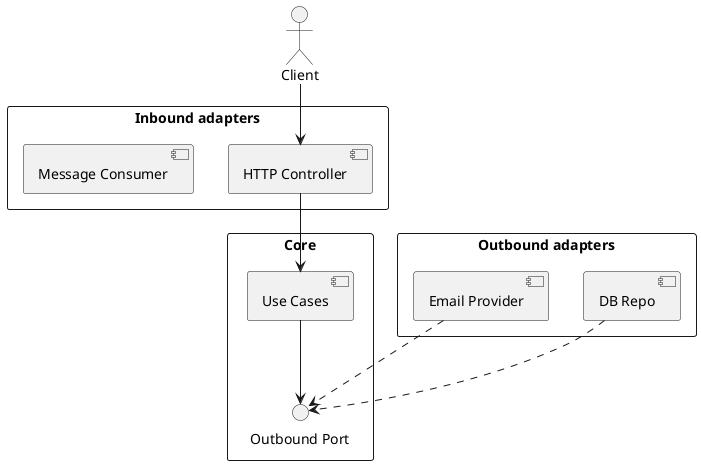

# Hexagonal Architecture (Ports & Adapters)

## En una línea
> El núcleo (dominio/casos de uso) se conecta al mundo externo mediante **ports (interfaces)** y **adapters (implementaciones)**, permitiendo intercambiar DB/framework/servicios sin romper el core.

## Objetivos / atributos de calidad
- Performance: ✅ overhead bajo; depende de adapters
- Escalabilidad: ✅ muy buena para crecer con integraciones
- Disponibilidad: ✅ favorece aislar fallos externos con adapters
- Seguridad: ✅ boundaries claros; core testeable
- Mantenibilidad: ✅ alta; reduce acoplamiento

## Componentes típicos
- Core (domain + use cases)
- Inbound adapters: HTTP controllers, CLI, cron, consumers
- Outbound adapters: DB repos, cache, brokers, APIs externas
- Ports: interfaces que el core usa/expone

## Flujo / interacción
- Inbound adapter → core (port) → outbound port → outbound adapter

## Diagrama

![[Hexagonal Architecture.png]]

## Decisiones típicas
- Qué es port vs adapter (port = contrato, adapter = implementación)
- Si los ports son “driven” (outbound) o “driving” (inbound)
- Diseño de interfaces para minimizar leakage (no filtrar ORM types al core)

## Trade-offs
- Pros
  - Core independiente del framework
  - Testeabilidad alta (mocks/fakes por ports)
  - Integraciones intercambiables
- Contras
  - Más estructura/boilerplate
  - Puede sentirse pesado en apps pequeñas

## Cuándo usar / no usar
- ✅ Apps que integran con muchos servicios externos
- ✅ Backend serio con evolución esperada
- ❌ CRUD pequeño de vida corta

## Observabilidad / operación
- Logs: loguea en adapters (entrada/salida) + en use cases clave
- Métricas: por adapter (latencia DB, latencia upstream)
- Runbook: “si falla X adapter, degradar o fallback”

## Relacionado
- Patrones: [[Adapter]], [[Dependency Injection]], [[Circuit Breaker]]
- ADRs: [[ADR-XX]]

## Referencias
- Alistair Cockburn — Hexagonal Architecture
