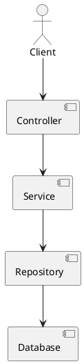

# Arquitectura en capas (Layered / N-tier)

## En una línea
> Organiza el sistema en **capas** (presentación → negocio → datos) para separar responsabilidades y mantener orden.

## Objetivos / atributos de calidad
- Performance: ✅ simple, pero puede añadir overhead si hay demasiadas capas
- Escalabilidad: ✅ escala como app; capas ayudan a mantener el orden
- Disponibilidad: ✅ operación simple
- Seguridad: ✅ fácil centralizar validaciones y auth en capas superiores
- Mantenibilidad: ✅ buena si evitas “saltos” entre capas

## Componentes típicos
- Presentación: controllers/routes (Express/Nest controllers)
- Negocio: services/use-cases
- Datos: repositories/ORM
- Infra: integraciones externas

## Flujo / interacción
- Request flow (alto nivel)
  - Controller → Service → Repository → DB → respuesta

## Diagrama

![[Arquitectura por Capas.png]]

## Decisiones típicas
- ¿Las capas pueden “saltar” o solo llamar a la inmediatamente inferior?
- ¿Dónde van DTOs y validación?
- ¿Servicios son “anémicos” (solo llaman repo) o encapsulan reglas?

## Trade-offs
- Pros
  - Fácil de entender
  - Muy común en NestJS/Express
  - Buen “default”
- Contras
  - Puede degenerar en “service llama repo” sin dominio real
  - Si metes lógica en controllers, pierdes el beneficio
  - Testing puede volverse pesado si no hay boundaries claros

## Cuándo usar / no usar
- ✅ CRUD apps, APIs estándar, proyectos medianos
- ✅ Cuando tu equipo necesita estructura simple
- ❌ Dominios complejos donde quieres independencia fuerte del framework/DB (mejor Clean/Hexagonal)

## Observabilidad / operación
- Logs / métricas / tracing: añade requestId en controller y propágalo
- Alertas: errores por ruta, latencia por capa (DB vs upstream)
- Runbook básico: identificar si el cuello es repo/DB o servicios externos

## Relacionado
- Patrones: [[Chain of Responsibility]] (middlewares), [[Facade]], [[Adapter]]
- ADRs: [[ADR-XX]]

## Referencias
- Fowler — Layered patterns (EAA)
