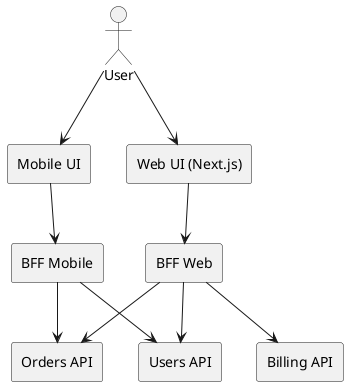

# BFF (Backend for Frontend)

## En una línea
> Un backend dedicado por cada frontend (web, mobile, admin) para entregar **API a medida**: menos overfetch/underfetch, menos lógica de agregación en el cliente y mejor control de caché/seguridad.

## Objetivos / atributos de calidad
- Performance: ✅ reduce roundtrips; ✅ payloads optimizados por UI
- Escalabilidad: ✅ escala por cliente; ⚠️ más servicios a operar
- Disponibilidad: ✅ aísla fallos por frontend; ⚠️ es un punto más en la cadena
- Seguridad: ✅ centraliza auth/authorization y “policy por UI”
- Mantenibilidad: ✅ UI y API evolucionan juntas; ⚠️ riesgo de duplicar lógica

## Componentes típicos
- Frontend Web (React/Next)
- Frontend Mobile (si aplica)
- BFF Web (Node/TS, Express/Fastify/Nest)
- BFF Mobile (si aplica)
- APIs de dominio (Users/Orders/Billing) o monolito
- Cache (opcional) y agregación de datos

## Flujo / interacción
- Request flow (alto nivel)
  - UI → BFF → (1..N servicios/DB) → BFF agrega/transforma → UI

## Diagrama

![[Backend for Frontend Architecture.png]]

## Decisiones típicas
- ¿BFF por plataforma (web/mobile) o por producto (admin/cliente)?
- ¿BFF hace solo agregación o también lógica de “view model”?
- ¿Cómo manejar caching (server-side) y revalidación?
- ¿Dónde vive la autorización fina: BFF, servicios, o ambos?

## Trade-offs
- Pros
  - UX mejora: menos llamadas desde el cliente
  - Payloads exactos para cada pantalla
  - Permite evolución rápida de UI sin tocar todos los servicios
- Contras
  - Duplicación potencial (dos BFFs hacen cosas similares)
  - Más servicios que monitorear
  - Si el BFF se vuelve “mini monolito” sin límites, se complica

## Cuándo usar / no usar
- ✅ Cuando tienes múltiples UIs con necesidades distintas (web vs mobile vs admin)
- ✅ Cuando sufres overfetch/underfetch o demasiados roundtrips
- ❌ Si solo hay una UI simple y un backend simple (sobrecarga)
- ❌ Si el equipo no puede operar más servicios

## Observabilidad / operación
- Logs / métricas / tracing: medir latencia por dependencia (U/O/B), cache hit rate, errores por ruta UI
- Alertas: p95/p99 por endpoint, error rate, saturación upstream
- Runbook básico: degradación por servicio caído (fallback partial), activar cache, timeouts/retries

## Relacionado
- Patrones: [[Facade]], [[Adapter]], [[Cache-Aside]], [[Timeout]], [[Rate Limiting]]
- ADRs (si aplicas en proyectos): [[ADR-XX]]

## Referencias
- Sam Newman — BFF
- microservices.io — API Gateway (relacionado)
