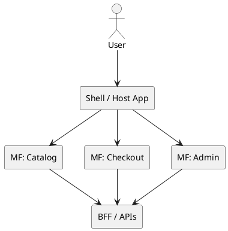

# Micro-frontend

## En una línea
> Divide un frontend grande en “sub-frontends” independientes (por dominio/feature) que pueden desplegarse por separado y componerse en una misma app.

## Objetivos / atributos de calidad
- Performance: ⚠️ puede empeorar si duplicas bundles/librerías
- Escalabilidad: ✅ escala equipos (cada equipo maneja su parte)
- Disponibilidad: ✅ fallo aislado (si hay fallback); ⚠️ composición puede ser punto débil
- Seguridad: ⚠️ cuidado con boundaries y shared auth/session
- Mantenibilidad: ✅ en orgs grandes; ⚠️ en equipos pequeños es sobrecarga

## Componentes típicos
- Shell/Host (container app)
- Remotes/Micro-apps (por dominio: catalog, checkout, admin)
- Shared design system (UI kit)
- Shared auth/session utilities (con control)
- CI/CD por micro-app

## Flujo / interacción
- Request flow (alto nivel)
  - Usuario carga Shell → Shell carga micro-app(s) → micro-app consume BFF/APIs → render

## Diagrama

![[Micro-Frontend Architecture.png]]

## Decisiones típicas
- Estrategia de integración: build-time vs runtime (module federation, iframes, etc.)
- Qué se comparte (React version, UI kit) y cómo evitar duplicación
- Navegación/routing global vs local
- Contratos entre micro-apps (event bus interno, shared state mínimo)

## Trade-offs
- Pros
  - Equipos pueden desplegar sin bloquearse
  - Aislamiento de dominios UI
  - Evolución incremental (migrar partes a nuevo stack)
- Contras
  - Complejidad alta (tooling, CI/CD, versionado)
  - Riesgo de UX inconsistente si no hay design system fuerte
  - Duplicación de dependencias y bundles grandes

## Cuándo usar / no usar
- ✅ Org grande, múltiples equipos, frontend muy grande
- ✅ Necesitas migrar legacy gradual
- ❌ Equipo pequeño o app pequeña/mediana (mejor monolito frontend bien modular)
- ❌ Si no tienes disciplina de diseño y tooling

## Observabilidad / operación
- Logs / métricas / tracing: performance web vitals por micro-app, errores JS por dominio
- Alertas: caída de remote bundle, regresiones de performance
- Runbook básico: rollback por micro-app, fallback si remote no carga, feature flags

## Relacionado
- Patrones: [[Facade]] (BFF como facade), [[Adapter]] (contratos), [[Observer]] (event bus UI)
- ADRs: [[ADR-XX]]

## Referencias
- Martin Fowler — Micro-frontends
