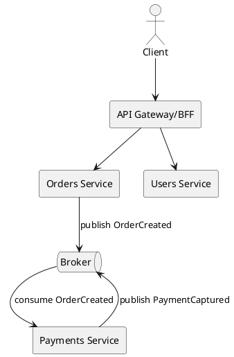

# Microservices

## En una línea
> Divide el sistema en servicios desplegables de forma independiente, cada uno con su propio dominio y (idealmente) su propia data.

## Objetivos / atributos de calidad
- Performance: ⚠️ overhead de red + coordinación
- Escalabilidad: ✅ escala por servicio según carga
- Disponibilidad: ✅ mejor aislamiento si está bien hecho
- Seguridad: ⚠️ superficie de ataque mayor, requiere disciplina
- Mantenibilidad: ✅ en equipos grandes, si los límites de dominio son correctos

## Componentes típicos
- Servicios por dominio (Orders, Payments, Users)
- API Gateway / BFF
- Broker de eventos (Kafka/Rabbit/SQS)
- Observabilidad (tracing/metrics/logging central)
- DB por servicio

## Flujo / interacción
- Sync: HTTP/gRPC entre servicios
- Async: Pub/Sub (eventos) para desacoplar
- Consistencia eventual: sagas/compensaciones

## Diagrama

![[Microservicios.png]]

## Decisiones típicas
- Boundaries por dominio (DDD ayuda)
- Comunicación sync vs async
- Data ownership (DB por servicio)
- Estrategias de consistencia (Saga/Outbox)

## Trade-offs
- Pros
  - Deploy y scaling independientes
  - Aislamiento de fallos (si bien diseñado)
  - Equipos autónomos
- Contras
  - Complejidad operacional enorme
  - Debugging distribuido (tracing obligatorio)
  - Consistencia eventual y duplicados (idempotency)

## Cuándo usar / no usar
- ✅ Cuando tienes varios equipos y dominios claros
- ✅ Necesitas escalar partes específicas
- ❌ Para aprender o para MVP (normalmente mejor monolito modular primero)

## Observabilidad / operación
- Logs/metrics/tracing: obligatorio (OpenTelemetry)
- Alertas: latencia inter-servicio, consumer lag, DLQs, errores por dependencia
- Runbook: degradación parcial, circuit breaker, replay de eventos

## Relacionado
- Patrones: [[Circuit Breaker]], [[Retry Backoff]], [[Idempotency Key]]
- ADRs: [[ADR-XX]]

## Referencias
- Martin Fowler — Microservices
