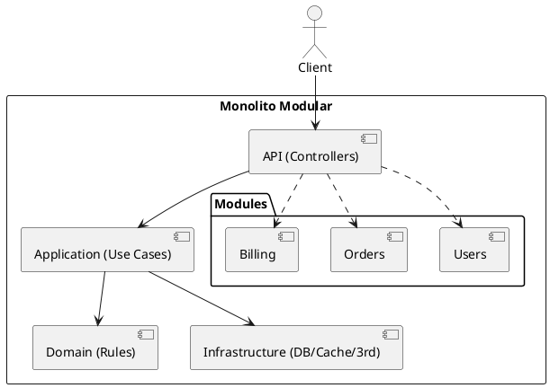

# Monolito modular (Modular Monolith)

## En una línea
> Una sola app desplegable (un deployment), pero organizada en **módulos internos** con límites claros (dominio/feature), para escalar complejidad sin saltar a microservicios.

## Objetivos / atributos de calidad
- Performance: ✅ llamadas internas baratas (in-process)
- Escalabilidad: ✅ escala vertical/horizontal como una app; módulos ayudan a crecer sin caos
- Disponibilidad: ✅ simple de operar; un solo runtime
- Seguridad: ✅ una superficie de ataque; controles centralizados
- Mantenibilidad: ✅ alta si se respeta modularidad; baja si se vuelve “Big Ball of Mud”

## Componentes típicos
- Módulos por dominio/feature (Users, Billing, Orders…)
- Capa de API (controllers/routes)
- Capa de aplicación (use cases/services)
- Capa de dominio (entidades/reglas)
- Infra (DB, cache, brokers, integraciones)

## Flujo / interacción
- Request flow (alto nivel)
  - Cliente → API routes/controllers → Use case → Repos/Integraciones → Respuesta

## Diagrama

![[Monolito Modular.png]]

## Decisiones típicas
- Definir módulos por dominio (no por “tipo de archivo”)
- Establecer reglas de dependencia (ej: módulos no se importan circularmente)
- Decidir si hay “shared kernel” (utilidades comunes) y cómo limitarlo

## Trade-offs
- Pros
  - Operación simple, despliegue simple
  - Consistencia fuerte más fácil (1 DB/1 transacción)
  - Buen rendimiento interno
- Contras
  - Si no pones límites, se convierte en spaghetti
  - Escala equipos grandes con fricción (muchos tocando lo mismo)
  - Cambios grandes pueden requerir deploy completo

## Cuándo usar / no usar
- ✅ Proyectos que crecen, pero quieres operar simple (ideal para 1–10 devs)
- ✅ Cuando todavía estás aprendiendo (tu caso)
- ❌ Si necesitas escalado independiente por componente desde el día 1
- ❌ Si ya tienes muchos equipos autónomos y dominios claramente separados

## Observabilidad / operación
- Logs / métricas / tracing: unificado en un solo servicio
- Alertas: latencia, error rate, saturación DB, memory/cpu
- Runbook básico: reiniciar instancia, rollback release, revisar logs por requestId

## Relacionado
- Patrones: [[Facade]], [[Dependency Injection]], [[Repository]]
- ADRs (si aplicas en proyectos): [[ADR-XX]]

## Referencias
- Martin Fowler — MonolithFirst / Modular Monolith (conceptos)
