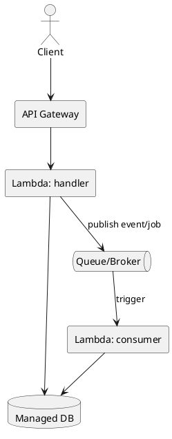

# Serverless (FaaS + managed services)

## En una línea
> Arquitectura donde ejecutas lógica en **funciones** (Lambda/Cloud Functions) y apoyas casi todo en servicios administrados (DB, queues, auth), pagando por uso y escalando automáticamente.

## Objetivos / atributos de calidad
- Performance: ✅ escala rápido; ⚠️ cold starts en algunos casos
- Escalabilidad: ✅ excelente (autoscaling por defecto)
- Disponibilidad: ✅ alta si usas managed services
- Seguridad: ✅ IAM granular; ⚠️ mal configurado puede abrir puertas
- Mantenibilidad: ⚠️ puede complicarse por “muchas funciones” y configuración distribuida

## Componentes típicos
- API Gateway / HTTP Trigger
- Funciones (handlers) por endpoint/evento
- DB administrada (DynamoDB / Aurora / Firestore)
- Broker/colas (SQS/SNS/PubSub)
- Storage (S3)
- Observabilidad (logs/tracing)

## Flujo / interacción
- Request flow (alto nivel)
  - Cliente → API Gateway → función → DB/servicios → respuesta
- Event flow:
  - Evento → cola/broker → función consumer → side-effects

## Diagrama

![[Serverless Architecture.png]]

## Decisiones típicas
- ¿Funciones por “endpoint” o por “dominio”?
- ¿Cómo manejar cold starts? (provisioned concurrency, rutas calientes)
- ¿Estado y sesiones? (stateless + tokens)
- ¿Límites de tiempo y retries? (timeouts, DLQ)
- ¿Observabilidad? (correlationId, tracing)

## Trade-offs
- Pros
  - Operación mínima (no servidores que administrar)
  - Escala y costos por uso (bueno para cargas variables)
  - Integración natural con EDA
- Contras
  - Debug y testing local pueden ser más difíciles
  - Vendor lock-in (dependes de servicios cloud)
  - Cold starts y límites (timeout/memory)
  - “Sprawl” de funciones sin disciplina

## Cuándo usar / no usar
- ✅ APIs pequeñas/medianas, jobs/eventos, picos variables
- ✅ Cuando quieres velocidad sin operar infraestructura
- ❌ Latencia ultra baja y consistente (cold start duele)
- ❌ Flujos muy chatos pero con muchas llamadas internas (puede encarecer)
- ❌ Si no quieres lock-in cloud

## Observabilidad / operación
- Logs / métricas / tracing: por función (duration, errors, cold start), colas (lag), DB (throttling)
- Alertas: error rate, DLQ > 0, timeouts, throttles
- Runbook básico: replay DLQ, aumentar memoria, ajustar concurrency, revisar IAM

## Relacionado
- Patrones: [[Timeout]], [[Retry Backoff]], [[Idempotency Key]], [[Transactional Outbox]] (si aplica), [[Event-Driven: Pub/Sub + Consumer Idempotency]]
- ADRs: [[ADR-XX]]

## Referencias
- Martin Fowler — Serverless
- AWS Lambda docs
