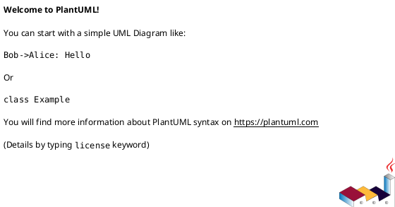

# {{title}}

## En una línea
> Qué es y para qué sirve.

## Objetivos / atributos de calidad
- Performance:
- Escalabilidad:
- Disponibilidad:
- Seguridad:
- Mantenibilidad:

## Componentes típicos
- Componente A:
- Componente B:

## Flujo / interacción
- Request flow (alto nivel)

## Diagrama

## Decisiones típicas
- Decisión 1: por qué / impacto
- Decisión 2: por qué / impacto

## Trade-offs
- Pros
- Contras

## Cuándo usar / no usar
- ✅
- ❌

## Observabilidad / operación
- Logs / métricas / tracing
- Alertas
- Runbook básico

## Relacionado
- Patrones: [[...]]
- ADRs (si aplicas en proyectos): [[...]]

## Referencias
-
